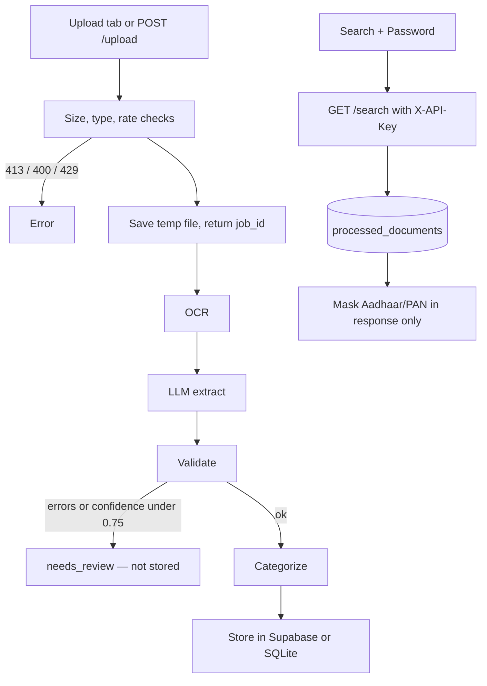

# DocuFlow — Complete Documentation

**Author:** Ayush Gupta  
**Source:** https://github.com/Ayush-2308/DocuFlow  
**Live demo:** https://docuflow-gbh3.onrender.com  
**API (Swagger):** https://docuflow-gbh3.onrender.com/docs  
**Default branch:** `main`  
**License:** MIT (2026)

This document describes the current product: what it does, how the pipeline works, the HTTP API, security, setup, tests, and known limits. It matches the code on `main`.

---

## 1. What DocuFlow is

DocuFlow is a **multi-agent document automation pipeline** with a web UI and HTTP API.

It is **not** a chatbot.

A user uploads an invoice, receipt, or KYC PDF/image. The backend:

1. Reads text (**OCR** — Mistral).
2. Turns that text into structured JSON (**LLM extraction** — Gemini / OpenAI / Anthropic).
3. Checks required fields, dates, totals, and ID formats (**validation**).
4. If quality is low, stops for **human review** (`needs_review`) and **does not** save a processed snapshot.
5. Otherwise assigns a **category** and **stores** the record.

A **Search** tab looks up **already stored** records by person or business name. Search does not re-run OCR. Aadhaar and PAN are **masked only in the search JSON response**. Full values remain in the database.

---

## 2. Problem it solves

Copying vendor names, invoice totals, or Aadhaar/PAN fields from PDFs by hand is slow and error-prone. DocuFlow automates:

**ingest → extract → validate → route → store**

Other apps can call `POST /upload`, poll `GET /jobs/{job_id}`, call `GET /search`, or read the database instead of parsing PDFs themselves.

---

## 3. Tech stack

| Layer | Choice |
|--------|--------|
| Language | Python 3.12+ |
| API / UI | FastAPI + Uvicorn + static HTML/CSS/JS |
| Orchestration | LangGraph `StateGraph` |
| Schemas | Pydantic v2 |
| OCR | Mistral OCR HTTP API |
| Extraction LLM | `gemini` (default in health), `openai`, or `anthropic` |
| Gemini model | `gemini-3.6-flash` only |
| Database | Supabase (Postgres + JSONB), with SQLite fallback if the Supabase hostname does not resolve |
| Config | `python-dotenv` + environment variables |
| HTTP | `httpx` |
| Tests | `unittest` |
| Hosting | Render (`rootDir`: `docuflow`) |

---

## 4. Architecture



**Upload path (sequence)**

```
POST /upload (file + doc_type_hint)
  → rate / size / type checks
  → save temp file
  → return { job_id, status: "processing" }     ← HTTP ends quickly
  → background: intake → OCR → extract → validate
       → needs_review  OR  categorize → storage
Browser polls GET /jobs/{job_id} every 2 seconds (up to 5 minutes)
```

Jobs are stored **in process memory**. A Render restart or new deploy drops in-flight `job_id`s. The temp upload file is deleted when the job finishes.

**Search path**

```
Search tab: query + Password
  → GET /search?query=...
  → Header X-API-Key = SEARCH_API_KEY
  → 401 if wrong/missing, 400 if empty query
  → parse intent → ILIKE name fields → mask Aadhaar/PAN in JSON
  → optional DELETE /documents with the same key
```

---

## 5. Repository layout

```
DocuFlow/
├── README.md
├── LICENSE                          # MIT, Ayush Gupta, 2026
├── SECURITY.md
├── CHANGELOG.md
├── docs/
│   ├── DOCUMENTATION.md             # Same content, in-repo
│   ├── EVALUATION.md                # Filled only by evaluate.py
│   └── images/                      # Add real screenshots here
└── docuflow/                        # Application root
    ├── main.py                      # FastAPI
    ├── graph.py                     # LangGraph
    ├── config.py
    ├── requirements.txt
    ├── .env.example
    ├── schemas/models.py
    ├── agents/                      # OCR, extract, validate, categorize, search
    ├── db/                          # Supabase + SQLite fallback + migrations.sql
    ├── utils/                       # sanitize, rate limit, upload checks
    ├── tests/
    ├── samples/                     # Synthetic SAMPLE PDFs
    ├── scripts/generate_samples.py
    ├── scripts/evaluate.py
    └── static/                      # Upload | Search UI
```

Never commit `.env` or real API keys.

---

## 6. Pipeline state

Shared state for every graph node (`PipelineState`):

| Field | Meaning |
|--------|---------|
| `document_id` | UUID for this run |
| `file_path` | Temp path of the uploaded file |
| `doc_type_hint` | `invoice` / `receipt` / `kyc` |
| `raw_text` | OCR output |
| `extracted_data` | Validated JSON dict |
| `confidence_score` | 0–1 from validation |
| `validation_errors` | List of rule failures |
| `category` | e.g. Travel Expense, Identity Verification |
| `status` | `pending` → `intake` → `ocr` → `extracted` → `validated` → `categorized` / `needs_review` / `stored` |

LangGraph: `intake → ocr → extraction → validation → branch`

- If `validation_errors` is non-empty **or** `confidence_score < 0.75` (or score is `None`) → `needs_review` → END (no category, no processed insert).
- Else → `categorization` → `storage` → END.

---

## 7. Document schemas

**Invoice:** `vendor_name`, `invoice_number`, `date`, `line_items[]` (`description`, `quantity`, `unit_price`, `amount`), `subtotal`, `tax`, `total_amount`.  
Line amount must equal `quantity * unit_price`. Subtotal must equal the line sum. Total must equal subtotal + tax. Pydantic tolerance is **0.01**; the validation agent uses **0.05** on totals.

**Receipt:** `merchant_name`, `date`, `items[]` (`description`, `amount`), `total_amount` equal to the item sum.

**KYC:** `full_name`, `document_type` (`Aadhaar` / `PAN` / `Passport`), `id_number`, `date_of_birth`, `address`.

- Aadhaar: 12 digits (spaces allowed on input, stored normalized).
- PAN: `ABCDE1234F` (5 letters, 4 digits, 1 letter).
- Passport: `A1234567` (1 letter + 7 digits).

Dates accept ISO and common `DD/MM/YYYY`-style strings.

**Categories** (keyword rules, not an LLM):

- KYC always → Identity Verification
- Else Travel Expense, Office Supplies, Meals & Entertainment, Software & Subscriptions, or Uncategorized

---

## 8. Agents

### OCR (`agents/ocr_agent.py`)

- Input: local file path.
- Output: extracted text.
- How: Base64 data URL to Mistral `POST {OCR_ENDPOINT}` (default `https://api.mistral.ai/v1/ocr`).
- PDFs use `document_url`; images use `image_url`.
- Failures raise `OCRError`. **No HTTP retries.** Timeout 120s.

### Extraction (`agents/extraction_agent.py`)

- Input: OCR text + `doc_type_hint`.
- Output: dict matching Invoice, Receipt, or KYCDocument.
- Prompt includes the Pydantic JSON schema; the model must return JSON only.
- If JSON/schema is invalid: **one correction prompt**, then retry.
- Providers: OpenAI `gpt-4o-mini`, Anthropic `claude-3-5-sonnet-latest`, Gemini `gemini-3.6-flash`.

### Validation (`agents/validation_agent.py`)

- Required fields present.
- Dates parse and are not in the future.
- Invoice totals within 0.05.
- KYC ID format checks.
- Confidence ≈ `1 - failed_checks / total_checks`.

### Categorization (`agents/categorization_agent.py`)

Keyword match on vendor/merchant names and item descriptions.

### Search (`agents/search_agent.py`)

Not part of the upload graph. Used only by `GET /search`. Short names skip the LLM; longer phrases ask the LLM for `{name, doc_type, latest}`.

### Storage (`db/supabase_client.py`)

Inserts/upserts `documents` and `processed_documents`. If the Supabase hostname does not resolve, operations fall back to local SQLite (`docuflow/data/`). On Render that disk is ephemeral.

---

## 9. HTTP API

| Method | Path | Auth | Purpose |
|--------|------|------|---------|
| GET | `/` | none | Static UI |
| GET | `/static/*` | none | CSS / JS |
| GET | `/health` | none | `{ ok, llm_provider, gemini_model, storage }` |
| GET | `/docs` | none | Swagger |
| POST | `/upload` | none | Multipart `file` + `doc_type_hint` → `{ job_id, status }` |
| GET | `/jobs/{job_id}` | none | processing / done / error |
| GET | `/search?query=` | **X-API-Key** | Search stored extracted data |
| DELETE | `/documents` | **X-API-Key** | Body `{ "document_ids": ["uuid", ...] }` (1–50) |

`doc_type_hint`: `invoice`, `receipt`, `kyc`. Empty file → **400**.

### Upload limits (POST /upload)

| Check | Default | HTTP |
|--------|---------|------|
| Max size | `MAX_UPLOAD_MB` = 10 | **413** |
| Types | PDF, PNG, JPG/JPEG (extension + file bytes) | **400** |
| Rate | `UPLOAD_RATE_LIMIT` = 10 per IP per minute | **429** |

These two env vars are **optional**. If unset, defaults apply and the app still boots.

### Search details

- Header `X-API-Key` must equal `SEARCH_API_KEY`. Missing/wrong → **401**. Empty query → **400**.
- Masking is **response-only**. Database rows stay full.
  - Aadhaar: `XXXX-XXXX-` + last 4 digits
  - PAN: first 5 characters → `X` (e.g. `ABCDE1234F` → `XXXXX1234F`)
  - Passport is **not** specially masked
- The Upload result screen is **not** masked.

### Example: upload then poll

```bash
curl -X POST "http://127.0.0.1:8000/upload" \
  -F "file=@./samples/invoice_hotel.pdf" \
  -F "doc_type_hint=invoice"

curl "http://127.0.0.1:8000/jobs/<job_id>"
```

### Example: search

```http
GET /search?query=SAMPLE
X-API-Key: <SEARCH_API_KEY>
```

### Example: delete

```http
DELETE /documents
X-API-Key: <SEARCH_API_KEY>
Content-Type: application/json

{ "document_ids": ["<uuid>"] }
```

---

## 10. Database

Run `docuflow/db/migrations.sql` once in the Supabase SQL editor.

| Table | Role |
|--------|------|
| `documents` | `document_id` PK, path, type hint, status |
| `processed_documents` | Full snapshot: OCR text, JSON, confidence, errors, category |
| `pipeline_errors` | Error strings per `document_id` |

Search needs JSON keys `full_name`, `vendor_name`, and/or `merchant_name`.

---

## 11. Frontend

Two tabs: **Upload** and **Search**. Cream/paper layout.

**Upload:** drag-and-drop or file picker; type dropdown; poll job; chips for status, category, confidence; extracted fields; validation errors; raw OCR and JSON.

**Search:** query + **Password** (this is `SEARCH_API_KEY`, not a user account). Not prefilled. Last value may sit in `sessionStorage` for that tab. Checkboxes + Delete selected.

---

## 12. Environment variables

Copy `docuflow/.env.example` → `docuflow/.env`. On Render, set the same names.

**Required** (missing any of these crashes the app on boot):

| Variable | Role |
|----------|------|
| `SUPABASE_URL` | `https://….supabase.co` |
| `SUPABASE_KEY` | Server key |
| `OCR_API_KEY` | Mistral key |
| `OCR_ENDPOINT` | `https://api.mistral.ai/v1/ocr` |
| `OCR_PROVIDER` | `mistral` |
| `LLM_API_KEY` | Gemini / OpenAI / Anthropic key |
| `LLM_PROVIDER` | `gemini` \| `openai` \| `anthropic` |
| `SEARCH_API_KEY` | Shared secret for search/delete |

**Optional** (safe defaults; will not crash deploy if omitted):

| Variable | Default |
|----------|---------|
| `MAX_UPLOAD_MB` | 10 |
| `UPLOAD_RATE_LIMIT` | 10 requests per IP per minute |

Pick a long random `SEARCH_API_KEY`. Do not commit it.

---

## 13. Retry behavior (from the code, not guesses)

| Call | Retries | Backoff | Notes |
|------|---------|---------|--------|
| Mistral OCR | None | — | One POST, 120s timeout |
| OpenAI / Anthropic | None | — | One request, 120s timeout |
| Gemini | Up to **3** attempts | `sleep(1.5)` | Only HTTP **429** and **503** retry |
| Gemini models | `gemini-3.6-flash` only | — | Old names like `gemini-2.5-flash` are not used |
| JSON schema repair | **One** extra LLM call | Immediate | Not an HTTP retry |

There is no retry of the whole LangGraph job. A failure becomes `{ status: "error" }`.

---

## 14. Security and data handling

Honest current behavior:

- Aadhaar and PAN are stored **in full** in `processed_documents`.
- Masking happens only on **search responses**. The upload result view is not masked.
- Search “Password” is a **shared** `SEARCH_API_KEY`, not per-user login. Anyone with that secret can search and delete stored rows.
- `POST /upload` is public. Size, type, and per-IP rate limits are abuse reduction, not authentication.
- Rate limits are in-process memory (not shared across multiple Render instances).
- Temp upload files are deleted after the job.
- No encryption-at-rest is implemented in this repo.
- No retention policy beyond the delete API.
- SQLite fallback on Render is not durable cloud storage.

Would-do-next (not built): encrypt identity fields, retention job, per-user auth, mask IDs on the upload result view.

See `SECURITY.md` in the repo.

---

## 15. Local setup

```bash
cd docuflow
python -m venv .venv
.venv\Scripts\activate          # Windows
# source .venv/bin/activate     # macOS / Linux
pip install -r requirements.txt
copy .env.example .env          # then fill real keys
```

1. Run `db/migrations.sql` in Supabase.
2. Start from **`docuflow/`**:

```bash
uvicorn main:app --reload --host 127.0.0.1 --port 8000
```

3. UI: http://127.0.0.1:8000  
4. Swagger: http://127.0.0.1:8000/docs

---

## 16. Tests, samples, evaluation

From `docuflow/`:

```bash
python -m unittest discover -s tests -v
```

Tests mock OCR, LLM, and network. Dummy env is set in `tests/env_setup.py`.

Synthetic samples (all marked **SAMPLE - NOT REAL**, no real personal data):

```bash
python scripts/generate_samples.py
```

Files live in `docuflow/samples/` with `ground_truth.json`:

- 4 invoices (one with a deliberate total mismatch and a future date)
- 3 receipts
- 3 KYC docs (fake Aadhaar / PAN / Passport in valid formats)

Evaluation (needs **your real keys** in `.env`):

```bash
python scripts/evaluate.py
```

This writes `docs/EVALUATION.md` with real outcome/field/latency numbers. Do not fill that file with invented metrics.

**Note:** Invoice totals that fail Pydantic (0.01) can error at **extraction** before validation (0.05), so a mismatch sample may show `error` instead of `needs_review`. That is real pipeline behavior.

### Measured run (2026-10-06)

Local uvicorn with real `.env`. Dummy samples: 4 invoices, 3 receipts, 3 KYC PDFs. **Delete timings are omitted.** Tables: `docs/EVALUATION.md`.

| Metric | Result |
|---|---|
| Mistral OCR on real dummy PDF | **429** in 4.70s (code 1300). PDF jobs did not extract. |
| Gemini outcome accuracy | **8/10 (80.0%)** on dummy document text |
| Gemini field accuracy | **37/48 (77.1%)** |
| Average / p95 Gemini extract | **12.49s** / **25.72s** |
| Average / p95 extract+validate(+store) | **12.56s** / **25.72s** |
| Health `GET /health` | HTTP 200 in **1.470s** (gemini, sqlite) |
| Average / p95 upload HTTP | **0.063s** / **0.106s** (all 10 uploads HTTP 200) |
| Average / p95 upload E2E | **5.23s** / **8.90s** (job then Mistral OCR 429) |
| Unauthenticated `GET /search` | HTTP **401** in **0.079s** |
| Authenticated search (4 dummy names) | HTTP 200, 1 hit each; avg **0.048s**, p95 **0.056s** |

Per-file extract: hotel 6.56s (6/6), office supplies 18.63s (6/6), software 6.99s (6/6), mismatch invoice Gemini 429, coffee 15.76s (3/3), fuel 13.70s (3/3), bookstore 5.54s (3/3), Aadhaar 7.78s (5/5), PAN 9.18s (5/5), passport Gemini 503.

---

## 17. Deploy (Render)

1. Connect GitHub `Ayush-2308/DocuFlow`.
2. Root Directory: `docuflow`
3. Build: `pip install -r requirements.txt`
4. Start: `uvicorn main:app --host 0.0.0.0 --port $PORT`
5. Set all **required** env vars, including `SEARCH_API_KEY`.
6. Auto-deploy on push to `main`.

Free tier: first request can be slow (cold start). Keep the tab open while a job polls.

---

## 18. Worked examples

**Invoice:** Upload a hotel bill as type Invoice. OCR + LLM fill vendor, lines, tax, total. If `subtotal + tax ≈ total` and confidence ≥ 0.75 → category Travel Expense (keyword “hotel”) → `stored`. If validation fails → `needs_review` (not searchable).

**KYC then search:** Upload a sample Aadhaar as KYC, wait until `stored`. Search the name with Password = `SEARCH_API_KEY`. Response `id_number` looks like `XXXX-XXXX-7777`. The database still has the full number.

---

## 19. Feature list

- Pydantic models for Invoice, Receipt, KYC
- Mistral OCR (PDF + images)
- LLM JSON extraction with one repair retry
- Rule validation + confidence, review branch at 0.75
- Keyword categorization
- LangGraph + FastAPI + static Upload/Search UI
- Background jobs so hosted HTTP does not time out
- Gemini 429/503 retries; model `gemini-3.6-flash` only
- Identity search with masking and `X-API-Key`
- Select-and-delete from Search
- Optional upload size, type, and per-IP rate limits
- SQLite fallback if Supabase DNS fails
- Synthetic samples + evaluation script
- unittest suite
- MIT license, changelog, security notes

---

## 20. Limitations

- `doc_type_hint` is required (no auto-detect).
- Categorization is keywords, not LLM.
- Job status is in memory; deploys lose in-flight jobs.
- `needs_review` docs are not searchable.
- Upload UI can show full `id_number`.
- Search Password is a shared secret, not per-user auth.
- Quota/outages still fail the job after the retries above.
- Rate limiting is per process, not a global gateway.
- SQLite on Render is ephemeral.
- Do not commit API keys.

---

## 21. Troubleshooting

| Symptom | Likely cause |
|---------|----------------|
| Boot crash `Missing required environment variable` | A required key from section 12 is unset. Optional size/rate vars will not cause this. |
| Gemini 404 | Retired model name. This repo uses `gemini-3.6-flash` only. |
| 429 or 503 from Gemini | Quota or overload. Three retries with 1.5s sleep, then the job fails. |
| First Render request is slow | Free-tier cold start. |
| `Unknown job` | In-memory job map; restart/deploy dropped the id. |
| Search 401 | Password / `X-API-Key` ≠ `SEARCH_API_KEY`. |
| Processed a doc but Search is empty | Status was `needs_review` or `error` — nothing stored. |
| `[Errno -2] Name or service not known` | Supabase URL does not resolve. App falls back to SQLite. |

---

## 22. Interview one-liner

> I built a LangGraph document pipeline: Mistral OCR, LLM JSON extraction against Pydantic schemas, rule validation with a review gate, then Supabase storage. FastAPI exposes an upload UI with job polling plus a password-gated identity search that masks Aadhaar and PAN on the way out so other apps can integrate without parsing PDFs themselves.

---

## 23. Screenshots to add yourself

Put PNGs in `docs/images/`:

- `upload-result.png`
- `search-results.png`
- `needs-review.png`

Until those files exist, README image links are placeholders.
